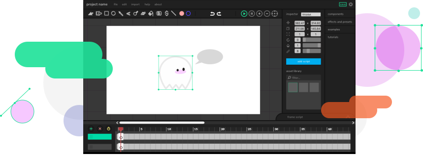

<h1 align="center">
  <br>
  <a href="https://editor.wickeditor.com/"></a>
  <br>
  Wick Editor
  <br>
</h1>

<p align="center">
  <a href="https://github.com/Wicklets/wick-editor/issues">
      
  </a>
  <a href="https://www.patreon.com/WickEditor">
      
  </a>
  <a href="LICENSE.md">
    
  </a>
  <a href="https://twitter.com/wickeditor?ref_src=twsrc%5Etfw">
    </a>
</p>

The Wick Editor is a free and open-source tool for creating games, animations, and everything in-between. It's designed to be the most accessible tool for creating multimedia projects on the web.

<p align="center"></p>

## Getting started

These instructions are for MacOS and Linux, we currently don't have instructions for Windows, but if you need help please feel free to email zach@wickeditor.com.

### Requirements

You'll need to download the following:

- [npm](https://www.npmjs.com/get-npm)

### Installation

1) Clone this repository:

    ```bash
    git clone https://github.com/Wicklets/wick-editor/
    ```

2) Using the command line, change directories into the newly created `wick-editor` folder:

    ```bash
    cd wick-editor
    ```

3) Install all dependencies using this command:

    ```bash
    npm install
    ```

### Running the Editor

1) Run the editor with this command:

    ```bash
    npm start
    ```

2) Open a web browser and go to this URL:

    ```bash
    localhost:3000
    ```

Have fun hacking on Wick! 🎉

### Deploying to Production

To deploy, you'll need to have push access to this repo.

1) Test the production build by using `npm predeploy`

2) Run `npm run deploy`

### Deploying to Prerelease

1) Run `npm run prerelease-deploy`

### Bundling the Electron App (Desktop App)

This build process uses [electron-packager](https://github.com/electron/electron-packager) and uses code from this tutorial: [Building an Electron application with create-react-app](https://www.freecodecamp.org/news/building-an-electron-application-with-create-react-app-97945861647c/).

1) Run `npm run build`

2) Run `electron-build-macos` and/or `electron-build-windows`

## Support

<a href="https://www.patreon.com/WickEditor">
	
</a>

## License

Wick Editor is under the GNU v3 Public License. See the [LICENSE](LICENSE.md) for more information.

## Links

* [Wick Editor Site](https://www.wickeditor.com)
* [Wick Editor Community Forum](https://forum.wickeditor.com/)
* [Follow on Twitter](https://twitter.com/wickeditor)
* [Follow on Facebook](https://www.facebook.com/wickeditor/)